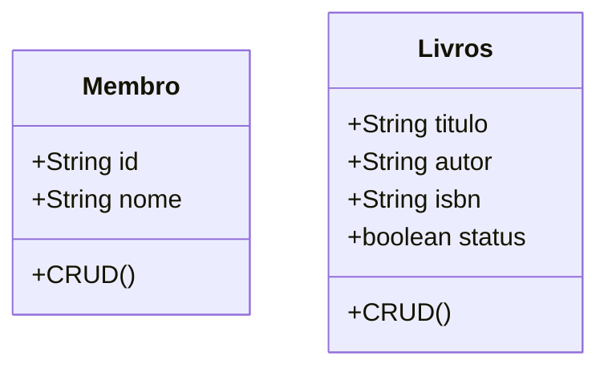
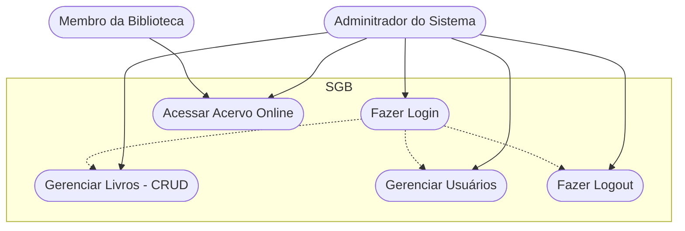
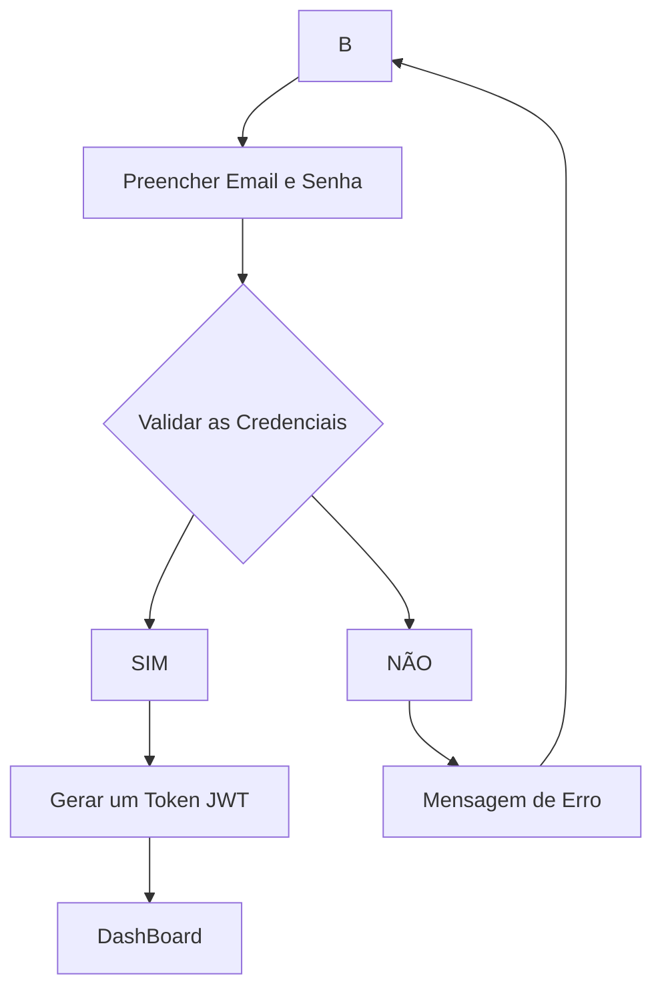

# Sistema de Gerenciamneto de Biblioteca (SGB) - Formativa

## Briefing
O projeto consiste no desenvolvimento de um sistema de gerenciamento de biblioteca (SGB) no formato de uma aplicação web. O objetivo é otimizar o controle das atividades de uma biblioteca. A plataforma permitirá o cadastro de membros, o empréstimo e a devolução de livros.

## Objetivo do Projeto
- gerenciar o empréstimo e a devolução de livros realizadas pelos membros.
- dashboard de devolução atrasada
- proteger acesso aos dados do sistema (criptografia e autenticação segura de usuários)

## Público-Alvo
- Membros (usuários finais)
- Bibliotecário (Gerencia o cadastro dos membros e dos livros)

## Recursos do Projeto
- ### Tecnológicos
    - Framework de Desenvolvimento Next/React
    - Linguagem de Programação: TypeScript
    - Banco de Dados: Não Relacional (MongoDB)
    - GitHub
    - VsCode
    - Figma

- ### Pessoal
    - Dev Tudo

## Diagramas

1. ### Classe
Descrever o Comportamento das Entidades de um Projeto

    - Membro (Member/Membro)
        - Atributos: id, nome
        - métodos: CRUD,

    - Livros (Books/Livros)
        - Atributos: titulo, autor, ISBN, status
        - Métodos: CRUD

2. ### Caso de Uso
Ilustra as interações dos diferentes tipos de usuários (Atores) com as funcionalidades do sistema

- Caso de Uso:
    - Bibliotecário: Gerenciar Membros do Sistema, acessar o Dashboard, realiza empréstimos e devoluções.

    - Membro: Acessa o acervo online

    Fazer o login -> Antes de Qualquer Ação

3. ### Fluxo
Detalha o passo a passo para realizar uma ação no sistema

- Diagrama  de fluxo de login
    - O bibliotecario acessa a tela de login
    -Insere as credenciais
    - O sistema verifica as Credenciais
        - se sim: ger um JWT (Token) => Dashboard
        - se não: manda uma mensagem de erro - Permanece a tela de Login

## Link do Figma
- https://www.figma.com/design/nmS5CuvbTelb2dc9mz6bzB/Untitled?node-id=0-1&t=W0B9yGUNuQurjyiq-1